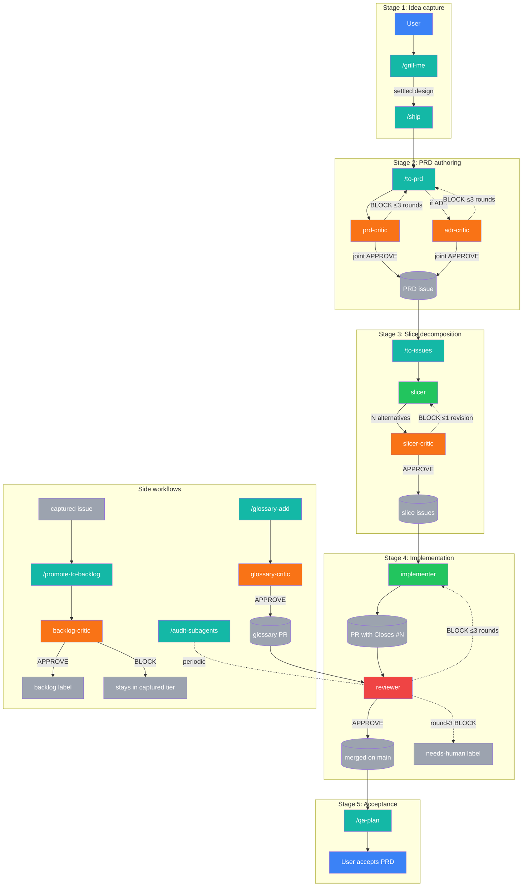

# project-claude

A clone-as-template starter for AI-coded projects, replicating the workflow of a **senior engineer overseeing a small team of developers** — but with AI agents instead of humans. Built on 20-year-old software engineering practices (small slices, fast feedback, git-tracked changes, PR review, scope discipline) and heavy borrowing from [Matt Pocock's skills repo](https://github.com/mattpocock/skills).

## What's the idea

You play **senior engineer**. AI agents play **the team**. The template ships an autonomous pipeline with **exactly two human-touch points**:

- **Start — `/grill-me`** — the agent interviews you about the idea until both of you share the same picture of what's being built.
- **End — `/qa-plan`** — after every slice of the PRD has merged, the agent produces a human-runnable acceptance checklist. You verify; you sign off.

Everything in between — PRD authoring, slice decomposition, implementation, review, merge — is autonomous, gated by adversarial AI critics rather than per-stage human approval.

The middle is glued together by one command: **`/ship`**. After `/grill-me`, you invoke `/ship` and the pipeline chains `to-prd → prd-critic → slicer → slicer-critic → implementer → reviewer → merge` per slice until the PRD is done. Stage 4 (implementation) is autonomous via the [`implementer`](.claude/agents/implementer.md) subagent — `/ship` auto-invokes it on each posted slice with DAG-aware parallel batching, no manual implementation trigger needed (per [ADR-0010](decisions/0010-implementer-subagent-auto-pipeline.md)). See [ADR-0003](decisions/0003-autonomous-pipeline-with-critics.md) D2 for the 5-stage pipeline and [ADR-0003](decisions/0003-autonomous-pipeline-with-critics.md) D4 for why there are no human gates in the middle.

**QA stage refinement (Tier 1, ADR-0020).** The terminal `/qa-plan` checkpoint is being refined into a writer/executor split: the writer (skill) LLM-extracts each PRD §2 acceptance criterion into a mechanical bash check or a `JUDGMENT` flag, then dispatches the [`qa-tester`](.claude/agents/qa-tester.md) generator subagent (tools: Read/Bash/Grep only) to execute the plan and return a per-criterion verdict table. Judgment rows are surfaced to you via `AskUserQuestion`; on all-PASS-and-accept the PRD auto-closes. Slice 1 of [PRD #166](https://github.com/vojtech-stas/project-claude/issues/166) ships the executor (`qa-tester`); the writer-side `/qa-plan` rewrite + closed-PRD-#147 dogfood land in slice 2. Per [ADR-0020](decisions/0020-qa-automation-writer-executor.md) D9 + [ADR-0008](decisions/0008-workflow-autolog-bootstrap-and-naming.md) D7 the 6-critic-cap is honored — qa-tester is the 3rd generator (alongside `slicer` and `implementer`), not a 7th critic.

**Forward queue.** Future-PRD ideas live as `backlog`-labeled GitHub Issues + a "Backlog" column on the project board (per [ADR-0006](decisions/0006-backlog-and-session-continuity.md)). Browse with `gh issue list --label backlog`. Promotion to a PRD: `gh issue edit <N> --remove-label backlog --add-label prd` + `/grill-me #<N>`.

**Captured → backlog autopilot.** Per [ADR-0008](decisions/0008-workflow-autolog-bootstrap-and-naming.md), any agent that surfaces a deferred-work idea writes it as a `captured`-labeled issue and invokes the [`/promote-to-backlog`](.claude/skills/promote-to-backlog/SKILL.md) skill inline. The [`backlog-critic`](.claude/agents/backlog-critic.md) subagent gates the promotion against a 4-criterion rubric (actionable / scoped / not duplicate / clear); on APPROVE the autopilot swaps labels `captured` → `backlog`, on BLOCK the item stays in the captured tier as a graveyard for lazy human review (default-conservative per [ADR-0008](decisions/0008-workflow-autolog-bootstrap-and-naming.md) D4).

**Why two tiers?** `captured` is a low-bar safety net — agents capture deferred work indiscriminately (CLAUDE.md rule #11) so nothing gets lost; the autopilot's `backlog-critic` filters them down to the curated `backlog` queue you actually pick PRDs from. BLOCKed captures stay in the captured-tier graveyard for lazy human review — three options per item: cull (close), rescue (manually relabel `captured` → `backlog`), or restructure-and-recapture.

**Session continuity.** New Claude Code sessions reconstruct state from live state (`git log`, `gh issue list`, `gh pr list`, project board) — no formal handoff document. See the "Session continuity" section in [CLAUDE.md](CLAUDE.md) for the canonical procedure.

## Pipeline diagram

The whole autonomous composition at a glance: the human enters at **`/grill-me`** and exits at **`/qa-plan`**, with everything in between — PRD authoring, slice decomposition, implementation, review, merge — chained by **`/ship`** and gated by adversarial critic loops (≤3 rounds each). The joint `prd-critic` + `adr-critic` gate, the `reviewer` auto-merge red-gate, and the `needs-human` forward-block paths are all shown; side workflows (`/audit-subagents`, `/glossary-add`, captured→backlog autopilot) live in their own subgraph.



### Legend

| Color | Class | Node type | Examples in the diagram |
|---|---|---|---|
| 🟦 Blue | `human` | Human checkpoint | `User` (input at `/grill-me`, acceptance at `/qa-plan`) |
| 🟩 Teal | `skill` | User-invocable skill | `/grill-me`, `/ship`, `/to-prd`, `/to-issues`, `/qa-plan`, `/audit-subagents`, `/promote-to-backlog`, `/glossary-add` |
| 🟢 Green | `gen` | Generator subagent | `slicer` (N=3 or N=1 decompositions per ADR-0013), `implementer` (slice → PR) |
| 🟧 Orange | `critic` | Adversarial critic (≤3-round loop) | `prd-critic`, `adr-critic`, `slicer-critic`, `glossary-critic`, `backlog-critic` |
| 🟥 Red | `reviewer` | Auto-merge gate (per [ADR-0002](decisions/0002-autonomous-merge-policy.md)) | `reviewer` — the only critic that auto-merges on APPROVE |
| ⬜ Gray | `artifact` | GitHub artifact | PRD issue, slice issues, PR, merged commit, `needs-human` / `backlog` labels |

## Hierarchy — PRD → Slice → PR

Per [ADR-0003](decisions/0003-autonomous-pipeline-with-critics.md) D1, the unit-of-delivery hierarchy is exactly three tiers:

- **PRD** — GitHub Issue (label `prd`). One feature per PRD.
- **Slice** — GitHub sub-issue under the PRD (label `slice`). One INVEST-shaped vertical, fits in one PR.
- **PR** — one merged change, closes one slice via `Closes #<slice-issue>` in the PR body.

No `feature` label, no `slice-N-foo` branch names. Branches use Conventional Commits prefixes — `<type>/<issue-number>-<kebab-summary>`. See [CLAUDE.md](CLAUDE.md) "Hierarchy" and "Operational git workflow" for the full operational logic.

## Adversarial critics

Per [ADR-0003](decisions/0003-autonomous-pipeline-with-critics.md) D2, every generation stage in the pipeline is paired with an adversarial critic running a ≤3-round APPROVE/BLOCK loop. Five critics ship today:

- **`prd-critic`** — gates PRD drafts.
- **`adr-critic`** — gates ADR drafts. Per [ADR-0004](decisions/0004-bypass-prevention.md) D1, when a macro-ADR is drafted alongside a PRD, `prd-critic` and `adr-critic` run as a **joint-APPROVE gate** — both must APPROVE before `/to-prd` posts.
- **`slicer-critic`** — picks best of N slicer decompositions (typically 3; may be 1 for degenerate cases per ADR-0013), then iterates.
- **`reviewer`** — gates every PR; auto-merges on APPROVE, returns to implementer on BLOCK, escalates with `needs-human` on round-3 BLOCK.
- **`glossary-critic`** — gates additions to the consolidated CLAUDE.md glossary (see "Shared vocabulary" below). Added per [ADR-0007](decisions/0007-vocabulary-glossary-and-grill-me-extension.md) D5; rubric updated to 5 rules per [ADR-0012](decisions/0012-glossary-consolidation-single-tier.md) D4.

The loop convention (generator proposes → critic challenges against explicit rubric → generator revises → ≤3 rounds → APPROVE or escalate) is the canonical pattern from [ADR-0003](decisions/0003-autonomous-pipeline-with-critics.md) D2.

## Workflow enforcement

Per [ADR-0004](decisions/0004-bypass-prevention.md) D3, three independent failure-domain defenses prevent the pipeline from being bypassed:

1. **Pre-commit hook** — [`.githooks/pre-commit`](.githooks/pre-commit) checks branch-name regex and refuses commits to `main`. Install with `.githooks/install.sh` (idempotent `git config core.hooksPath .githooks`).
2. **Branch protection R1 + R2** — live on `main`: no direct push (R1), require pull request (R2). R3 (required approving reviews) and R4 (required CI status checks) are deferred to a future PRD that bundles bot identity + GitHub Actions.
3. **Reviewer rule R-CLOSES** — PRs without `Closes #<slice-issue>` referencing a valid `slice`-labeled issue are BLOCKed at review time.

The workflow is no longer "discipline-only convention" — these three layers enforce it mechanically.

Per [ADR-0018](decisions/0018-boy-scout-reviewer-rule.md), a fourth (discretionary, defense-in-depth) layer rides on the reviewer's existing gate: the **R-BOY-SCOUT** rule fires when a PR touches audit-relevant files (`.claude/agents/*.md`, `.claude/skills/*/SKILL.md`, `decisions/*.md`, `CLAUDE.md`, `README.md`) and applies the relevant `/audit-subagents` + `/audit-meta` rubric checks inline against the touched files only. Default-conservative-toward-Recommendation; only zero-false-positive findings with mechanical fixes BLOCK.

The pipeline is complemented at the Claude Code session level by **hooks** ([`.claude/settings.json`](.claude/settings.json)) configured per [ADR-0015](decisions/0015-claude-code-hooks-adoption.md) for logging / validation / notification (no skill auto-invocation; that requires session interaction). The first hook (PostToolUse on subagent edits) seeds the workflow event log substrate that PRD-β extends.

**Workflow event log.** Per [ADR-0016](decisions/0016-workflow-event-log-jsonl.md), three additional hooks (`PostToolUse(Agent)`, `PostToolUse(Bash)`, `Stop`) append JSONL events to [`.claude/logs/workflow-events.jsonl`](.claude/logs/) for run-time observability — which subagents fired, which bash commands ran, where session boundaries fell. Greppable from any session (`grep '"event":"agent_complete"' .claude/logs/workflow-events.jsonl`) and read by future audit-meta tooling.

## Output-shape standard

The critics and the output-emitting skills (`slicer`, `qa-plan`, `ship`) conform to a canonical output shape defined in [CLAUDE.md](CLAUDE.md) — see the **"Output-shape standard for subagents and output-emitting skills"** section there for the canonical verdict template and the CRITIC / GENERATOR trailer schemas. Templates are not restated here (DRY per [CLAUDE.md](CLAUDE.md) rule #9). Rationale lives in [ADR-0005](decisions/0005-output-shape-and-slicing-methodology.md) D1.

## Use it

```bash
git clone https://github.com/vojtech-stas/project-claude my-new-project
cd my-new-project
./bootstrap.sh         # one-time: labels, git hooks, branch protection (idempotent)
# open in Claude Code — CLAUDE.md auto-loads, the agents are oriented
```

[`bootstrap.sh`](bootstrap.sh) is the canonical fresh-clone setup per [ADR-0008](decisions/0008-workflow-autolog-bootstrap-and-naming.md) D6: it creates the 6 repo labels (`prd`, `slice`, `backlog`, `captured`, `trivial`, `needs-human`), installs the pre-commit hook via `core.hooksPath`, detects the GitHub Project v2 board, and applies branch protection R1+R2 to `main`. Every step is idempotent (safe to re-run) and best-effort (single-step failures warn-and-continue).

Then: `/grill-me` to start a new feature, `/ship` to hand off to the autonomous pipeline, `/qa-plan` to verify when the last slice merges.

## What's inside

- **[CLAUDE.md](CLAUDE.md)** — project rules, auto-loaded by Claude Code every session. Canonical home for the cross-cutting rules, hierarchy, slicing methodology overview, and output-shape standard.
- **[`.claude/skills/`](.claude/skills/)** and **[`.claude/agents/`](.claude/agents/)** — pipeline skills and subagents. See the Map table in [CLAUDE.md](CLAUDE.md) for what lives where.
- **[`decisions/`](decisions/)** — Architecture Decision Records. See [`decisions/README.md`](decisions/README.md) for the index, conventions, and the strict immutability rule.
- **[`docs/best-practices/`](docs/best-practices/)** — distilled best-practices KB from Anthropic-authoritative external sources (currently `@claude` + `@anthropic-ai` YouTube channels) per [ADR-0019](decisions/0019-best-practices-kb-pattern.md). Add new entries via [`/distill-video <youtube-video-id>`](.claude/skills/distill-video/SKILL.md); raw `.vtt` transcripts live under `transcripts/` for audit + re-distillation.
- **[`bootstrap.sh`](bootstrap.sh)** — fresh-clone setup script (labels, git hooks, branch protection); see [ADR-0008](decisions/0008-workflow-autolog-bootstrap-and-naming.md) D6.
- **[`.githooks/`](.githooks/)** — workflow-enforcement pre-commit hook.
- This README.

## Subagent-quality maintenance

Per [ADR-0011](decisions/0011-subagent-quality-framework.md), subagent prompts drift silently between slices (the 2026-05-19 audit demonstrated: 5 subagent files unchanged for multiple PRDs still instructed `--label backlog` instead of `--label captured`, bypassing the autopilot). The **`/audit-subagents`** skill ([`.claude/skills/audit-subagents/SKILL.md`](.claude/skills/audit-subagents/SKILL.md)) is the mechanical drift-detector: no-args invocation globs `.claude/agents/*.md`, applies a 10-check `scope`-tagged grep rubric (frontmatter, tool boundaries, references, surfacing convention, mandatory-reading-order, default-BLOCK clause, adversarial mindset, CRITIC trailer, 5-section verdict, GENERATOR trailer), and emits a single Markdown PASS/FAIL report. The skill is a GENERATOR per ADR-0005 D1c — advisory only, no auto-capture, no PR, no critic gate. Honors the [ADR-0008](decisions/0008-workflow-autolog-bootstrap-and-naming.md) D7 6-critic-cap (skill ownership, not a 7th critic). Invoke periodically or after merging a convention-changing ADR.

Per [ADR-0017](decisions/0017-audit-meta-consolidation.md), the sibling **`/audit-meta`** skill ([`.claude/skills/audit-meta/SKILL.md`](.claude/skills/audit-meta/SKILL.md)) covers the adjacent meta-quality concerns: codebase **structure** (file-counts, file-sizes, depth, naming conventions) and **documentation currency** (dangling refs, supersession notes, concrete drift detectors). Subcommand architecture: `/audit-meta` (no-args = both), `/audit-meta --structure`, `/audit-meta --docs`. Same advisory-only contract.

## Shared vocabulary

Per [ADR-0007](decisions/0007-vocabulary-glossary-and-grill-me-extension.md) (consolidated to single-tier per [ADR-0012](decisions/0012-glossary-consolidation-single-tier.md) D1), the project anchors load-bearing terms (e.g., *slice*, *critic*, *trivial*, *PRD*) in a **single-tier glossary** so agents and humans share the same definitions:

- **`## Glossary` in [CLAUDE.md](CLAUDE.md)** — auto-loaded by Claude Code on every session. Soft cap ~35 entries per [ADR-0012](decisions/0012-glossary-consolidation-single-tier.md) D5.

To add a term, run **`/glossary-add`** — it interviews you for the entry shape (definition, scope category, authority) and gates the addition through the `glossary-critic` subagent's 5-rule rubric (including ADR-0012 D2's ≥3-citations-across-≥2-directories inclusion threshold) before opening a trivial-lane PR.

## Status

Walking-skeleton phase. The pipeline is being built incrementally **on the project itself** — dogfooding from day one. The autonomous loop now ships PRDs end-to-end with all five stages live: `/grill-me` → `to-prd`+critics → `to-issues`+slicer-critic → `implementer`+`reviewer` (per slice, DAG-batched) → `/qa-plan` at acceptance.

## License

MIT — use it, fork it, ship it. A shoutout is appreciated.

## Credits

Inspired by [Matt Pocock's skills repo](https://github.com/mattpocock/skills) and the senior-engineer-over-agents workflow pattern.
