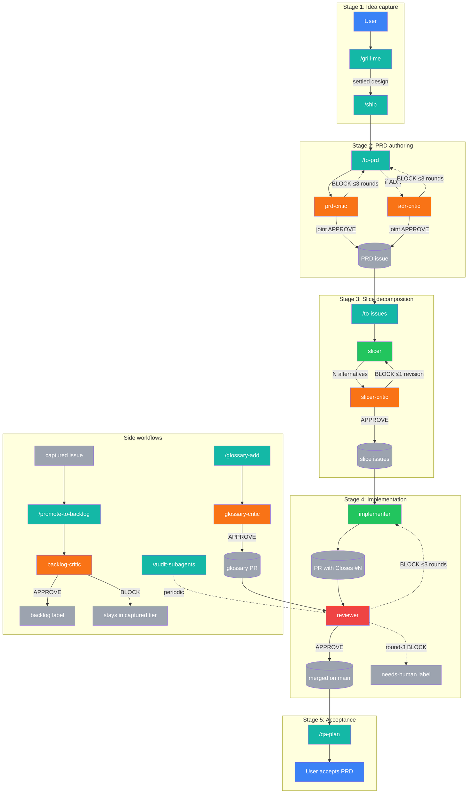

<!-- AUTO-GENERATED from docs/readme.template.md — edit the template, run the generator. -->
# project-claude

A clone-as-template starter for AI-coded projects, replicating the workflow of a **senior engineer overseeing a small team of developers** — but with AI agents instead of humans. Built on 20-year-old software engineering practices (small slices, fast feedback, git-tracked changes, PR review, scope discipline) and heavy borrowing from [Matt Pocock's skills repo](https://github.com/mattpocock/skills).

> **New here? Start here →** Jump to the [5-Minute Quickstart](#5-minute-quickstart) for a literal first-use cycle. Skim the [Concepts cheat sheet](#concepts-cheat-sheet) for one-line definitions. Hit the [FAQ](#frequently-asked-questions) for common newcomer questions. For deep theory, scroll to *What's the idea*; for the architecture, see [CLAUDE.md](CLAUDE.md).

## What's the idea

You play **senior engineer**. AI agents play **the team**. The template ships an autonomous pipeline with **exactly two human-touch points**:

- **Start — `/grill-me`** — the agent interviews you about the idea until both of you share the same picture of what's being built.
- **End — `/qa-plan`** — after every slice of the PRD has merged, the agent produces a human-runnable acceptance checklist. You verify; you sign off.

Everything in between — PRD authoring, slice decomposition, implementation, review, merge — is autonomous, gated by adversarial AI critics rather than per-stage human approval.

The middle is glued together by one command: **`/ship`**. After `/grill-me`, you invoke `/ship` and the pipeline chains `to-prd → prd-critic → slicer → slicer-critic → implementer → reviewer → merge` per slice until the PRD is done. Stage 4 (implementation) is autonomous via the [`implementer`](.claude/agents/implementer.md) subagent — `/ship` auto-invokes it on each posted slice with DAG-aware parallel batching, no manual implementation trigger needed (per [ADR-0010](decisions/0010-implementer-subagent-auto-pipeline.md)). See [ADR-0003](decisions/0003-autonomous-pipeline-with-critics.md) D2 for the 5-stage pipeline and [ADR-0003](decisions/0003-autonomous-pipeline-with-critics.md) D4 for why there are no human gates in the middle.

**QA stage (Tier 1, ADR-0020 — runnable end-to-end via `/qa-plan`).** The terminal `/qa-plan` checkpoint is a writer/executor split: the writer (skill, main-agent context) LLM-extracts each PRD §2 acceptance criterion into a mechanical bash check or a `JUDGMENT` flag, persists the plan as a PRD comment for audit + re-runnability, then dispatches the [`qa-tester`](.claude/agents/qa-tester.md) generator subagent (tools: Read/Bash/Grep only) to execute the plan and return a per-criterion verdict table. Judgment rows and EXTRACT_FAILED rows are surfaced to you via `AskUserQuestion`; on all-PASS + all-judgment-ACCEPT the PRD auto-closes. Shipped through the autonomous pipeline as the QA writer/executor split per [ADR-0020](decisions/0020-qa-automation-writer-executor.md). Per [ADR-0020](decisions/0020-qa-automation-writer-executor.md) D9 + [ADR-0008](decisions/0008-workflow-autolog-bootstrap-and-naming.md) D7 the 6-critic-cap is honored — qa-tester is the 3rd generator (alongside `slicer` and `implementer`), not a 7th critic.

**Forward queue.** Future-PRD ideas live as `backlog`-labeled GitHub Issues + a "Backlog" column on the project board (per [ADR-0006](decisions/0006-backlog-and-session-continuity.md)). Browse with `gh issue list --label backlog`. Promotion to a PRD: `gh issue edit <N> --remove-label backlog --add-label prd` + `/grill-me #<N>`.

**Captured → backlog autopilot.** Per [ADR-0008](decisions/0008-workflow-autolog-bootstrap-and-naming.md), any agent that surfaces a deferred-work idea writes it as a `captured`-labeled issue and invokes the [`/promote-to-backlog`](.claude/skills/promote-to-backlog/SKILL.md) skill inline. The [`backlog-critic`](.claude/agents/backlog-critic.md) subagent gates the promotion against a 4-criterion rubric (actionable / scoped / not duplicate / clear); on APPROVE the autopilot swaps labels `captured` → `backlog`, on BLOCK the item stays in the captured tier as a graveyard for lazy human review (default-conservative per [ADR-0008](decisions/0008-workflow-autolog-bootstrap-and-naming.md) D4).

**Why two tiers?** `captured` is a low-bar safety net — agents capture deferred work indiscriminately (CLAUDE.md rule #11) so nothing gets lost; the autopilot's `backlog-critic` filters them down to the curated `backlog` queue you actually pick PRDs from. BLOCKed captures stay in the captured-tier graveyard for lazy human review — three options per item: cull (close), rescue (manually relabel `captured` → `backlog`), or restructure-and-recapture.

**Session continuity.** New Claude Code sessions reconstruct state from live state (`git log`, `gh issue list`, `gh pr list`, project board) — no formal handoff document. See the "Session continuity" section in [CLAUDE.md](CLAUDE.md) for the canonical procedure.

## 5-Minute Quickstart

A literal walkthrough of the first full feature cycle. Pick something tiny — e.g., a `/say-hello` skill that prints a greeting. (Real PRDs are bigger; we use `/say-hello` here purely to make the example fit in 5 minutes.)

**1. Clone + bootstrap (one-time, ~30 seconds):**

```bash
git clone https://github.com/vojtech-stas/project-claude my-new-project
cd my-new-project
./bootstrap.sh         # creates labels, installs git hooks, applies branch protection
```

**2. Open the repo in Claude Code.** `CLAUDE.md` auto-loads; the agents are oriented.

**3. Grill the idea (~2 minutes).** Run `/grill-me I want a /say-hello skill that prints a friendly greeting`. The agent interviews you one question at a time:

```
Agent:  1. Should /say-hello take an optional name argument, or always greet "world"?
        Recommendation: 1B (optional argument) — slightly more useful, same LoC.
        1A. always "Hello, world!"     pros: dead simple; cons: not personalizable
        1B. optional name argument     pros: useful; cons: trivially more code
        1C. read name from git config  pros: zero-arg + personal; cons: edge cases
You:    1B
Agent:  2. Should output go to stdout, or use AskUserQuestion?
        ...
```

After 3-5 questions the agent confirms the settled design and returns.

**4. Ship it (autonomous, ~2 minutes wall-clock for a trivial example).** Run `/ship`. The orchestrator chains: `to-prd` → `prd-critic` (≤3 APPROVE/BLOCK rounds) → `slicer` → `slicer-critic` → posts the PRD + slice issues → `implementer` writes the code per slice → `reviewer` audits the PR → auto-merges on APPROVE. You watch; you don't touch.

**5. Verify (~30 seconds).** When the last slice merges, run `/qa-plan <PRD-number>`. The `qa-tester` subagent walks each acceptance criterion mechanically; subjective ones surface via `AskUserQuestion`. On all-PASS the PRD auto-closes.

That's the full loop. Two human commands (`/grill-me`, `/qa-plan`), one orchestration command (`/ship`), and the rest is autonomous.

## Concepts cheat sheet

One-line definitions of the load-bearing terms. For the full canonical glossary (with authority citations), see [CLAUDE.md `## Glossary`](CLAUDE.md#glossary).

- **PRD** — feature-sized GitHub issue (label `prd`); top of the PRD → Slice → PR hierarchy.
- **slice** — INVEST-shaped sub-issue of a PRD (label `slice`); one PR; ≤300 LoC diff.
- **skill** — user-invocable command at `.claude/skills/<name>/SKILL.md` (e.g., `/ship`).
- **subagent** — specialist at `.claude/agents/<name>.md` with isolated context + restricted tools.
- **critic** — adversarial subagent judging a stage's output with APPROVE/BLOCK (≤3 rounds).
- **generator** — subagent producing output (decompositions, code, test plans); paired with a critic.
- **autopilot** — inline-firing mechanism (e.g., `/promote-to-backlog` after a captured-label issue).
- **trivial-lane** — fast path (I3) for PRs ≤10 LoC; branch `hotfix/<N>-...`, label `trivial`.
- **truth-doc** — active-state KB notes under `docs/current/` (5-node taxonomy: concepts / entities / topics / patterns + `decisions/` alias) per [ADR-0031](decisions/0031-knowledge-architecture-v2.md); read via `current-state-reader`.

## Frequently asked questions

### Do I have to use `/grill-me`?

Recommended for any new feature. Skippable for the trivial lane (I3 — PRs ≤10 LoC, no behavior change, branch `hotfix/<N>-...`). The `/to-prd` skill also accepts a clear pre-written spec if you'd rather draft offline. The autopilot enforces no hard requirement today, though a future PRD may make `/grill-me` mechanically required for new features.

### Why is Claude asking permission to edit every file?

The `PreToolUse(Edit|MultiEdit|Write)` hook ([ADR-0023](decisions/0023-validation-and-notification-hooks-extension.md) D3) emits `permissionDecision: "ask"` when the **main agent** (not a subagent) writes a tracked file. This is the mechanical enforcement of CLAUDE.md rule #10 — main-agent meta-output discipline. Subagent edits (e.g., `implementer` shipping a slice) skip the prompt entirely. If you see prompts on every edit including untracked / gitignored files, you may be hitting captured issue #222 — make sure `jq` is installed and on your PATH.

### What if I want to skip critics?

You can't via the pipeline. The joint-APPROVE gate ([ADR-0004](decisions/0004-bypass-prevention.md) D1) is non-negotiable, and `reviewer` is the sole gate per PR ([ADR-0002](decisions/0002-autonomous-merge-policy.md)). You CAN, however, escalate a round-3 BLOCK to a `needs-human` label and apply your own judgment in a manual PR — that's the designed escape valve.

### How do I add a new subagent?

Author `.claude/agents/<name>.md` per [ADR-0001](decisions/0001-foundational-design.md) D6; declare tool boundaries in the frontmatter; write the body per the standards in [`/best-practice-subagents`](.claude/skills/best-practice-subagents/SKILL.md). If your new subagent is a critic, honor the 6-critic-cap meta-rule ([ADR-0008](decisions/0008-workflow-autolog-bootstrap-and-naming.md) D7) — a new ADR must justify why an existing critic's rubric can't absorb the concern.

### How do I keep up with what's true today?

Per [ADR-0031](decisions/0031-knowledge-architecture-v2.md), `docs/current/` holds a compiled knowledge base organized by 5-node taxonomy (concepts / entities / topics / patterns + `decisions/` alias) with typed edges. Topic files synthesize active state across the ADR + skill + subagent chain for a given topic (slicing, output-shape, hooks, etc.); concept files are atomic (glossary terms, rubric rules); entity files describe named artifacts (skills, subagents). Agents auto-load the relevant file via the [`current-state-reader`](.claude/agents/current-state-reader.md) subagent, dispatched by the topic-nudge `UserPromptSubmit` hook ([ADR-0026](decisions/0026-knowledge-architecture-truth-docs.md) D4) when your prompt mentions a covered topic. For the `current-state-reader` extension see [ADR-0031](decisions/0031-knowledge-architecture-v2.md) D6. Humans read them directly under `docs/current/topics/`, `docs/current/concepts/`, etc. The reviewer rule **R-TRUTH-DOC** enforces that any new or amended ADR ships an accompanying truth-doc update in the same PR.

### Why so many ADRs?

Each ADR is one architectural decision frozen at its moment per [`decisions/README.md`](decisions/README.md) "What an ADR is". The count reflects the template's walking-skeleton evolution — superseded decisions live on for audit + history, never edited in place. If you fork the template and decide differently for your project, you write new ADRs; the originals remain as the historical record.

### What does it mean if I see a `needs-human` label?

The reviewer applies `needs-human` on round-3 BLOCK ([ADR-0003](decisions/0003-autonomous-pipeline-with-critics.md) I5) — three rounds of generator/critic disagreement is the autonomy ceiling. A human needs to decide. Find them at session start with `gh pr list --label needs-human` and `gh issue list --label needs-human`. The reviewer also posts a summary to the parent PRD issue so you don't have to guess what's stuck.

## Pipeline diagram

The whole autonomous composition at a glance: the human enters at **`/grill-me`** and exits at **`/qa-plan`**, with everything in between — PRD authoring, slice decomposition, implementation, review, merge — chained by **`/ship`** and gated by adversarial critic loops (≤3 rounds each). The joint `prd-critic` + `adr-critic` gate, the `reviewer` auto-merge red-gate, and the `needs-human` forward-block paths are all shown; side workflows (`/audit-subagents`, `/glossary-add`, captured→backlog autopilot, and the topic-nudge `UserPromptSubmit` hook that dispatches `current-state-reader` per [ADR-0026](decisions/0026-knowledge-architecture-truth-docs.md) D4) live in their own subgraph or fire transparently around the main pipeline.



### Legend

| Color | Class | Node type | Examples in the diagram |
|---|---|---|---|
| 🟦 Blue | `human` | Human checkpoint | `User` (input at `/grill-me`, acceptance at `/qa-plan`) |
| 🟩 Teal | `skill` | User-invocable skill | `/grill-me`, `/ship`, `/to-prd`, `/to-issues`, `/qa-plan`, `/audit-subagents`, `/promote-to-backlog`, `/glossary-add` |
| 🟢 Green | `gen` | Generator subagent | `slicer` (N=3 or N=1 decompositions per ADR-0013), `implementer` (slice → PR) |
| 🟧 Orange | `critic` | Adversarial critic (≤3-round loop) | `prd-critic`, `adr-critic`, `slicer-critic`, `glossary-critic`, `backlog-critic` |
| 🟥 Red | `reviewer` | Auto-merge gate (per [ADR-0002](decisions/0002-autonomous-merge-policy.md)) | `reviewer` — the only critic that auto-merges on APPROVE |
| ⬜ Gray | `artifact` | GitHub artifact | PRD issue, slice issues, PR, merged commit, `needs-human` / `backlog` labels |

## Hierarchy — PRD → Slice → PR

Per [ADR-0003](decisions/0003-autonomous-pipeline-with-critics.md) D1, the unit-of-delivery hierarchy is exactly three tiers:

- **PRD** — GitHub Issue (label `prd`). One feature per PRD.
- **Slice** — GitHub sub-issue under the PRD (label `slice`). One INVEST-shaped vertical, fits in one PR.
- **PR** — one merged change, closes one slice via `Closes #<slice-issue>` in the PR body.

No `feature` label, no `slice-N-foo` branch names. Branches use Conventional Commits prefixes — `<type>/<issue-number>-<kebab-summary>`. See [CLAUDE.md](CLAUDE.md) "Hierarchy" and "Operational git workflow" for the full operational logic.

## Adversarial critics

Per [ADR-0003](decisions/0003-autonomous-pipeline-with-critics.md) D2, every generation stage in the pipeline is paired with an adversarial critic running a ≤3-round APPROVE/BLOCK loop. The project honors the **6-critic-cap meta-rule** per [ADR-0008](decisions/0008-workflow-autolog-bootstrap-and-naming.md) D7 — promoting a new critic requires a new ADR explicitly justifying why an existing critic's rubric cannot absorb the concern. Today's critics:

- **`prd-critic`** — gates PRD drafts.
- **`adr-critic`** — gates ADR drafts. Per [ADR-0004](decisions/0004-bypass-prevention.md) D1, when a macro-ADR is drafted alongside a PRD, `prd-critic` and `adr-critic` run as a **joint-APPROVE gate** — both must APPROVE before `/to-prd` posts.
- **`slicer-critic`** — picks best of N slicer decompositions (typically 3; may be 1 for degenerate cases per ADR-0013), then iterates.
- **`reviewer`** — gates every PR; auto-merges on APPROVE, returns to implementer on BLOCK, escalates with `needs-human` on round-3 BLOCK.
- **`glossary-critic`** — gates additions to the consolidated CLAUDE.md glossary (see "Shared vocabulary" below). Added per [ADR-0007](decisions/0007-vocabulary-glossary-and-grill-me-extension.md) D5; rubric updated to 5 rules per [ADR-0012](decisions/0012-glossary-consolidation-single-tier.md) D4.
- **`backlog-critic`** — gates `captured` → `backlog` label promotions against a 4-criterion rubric (actionable / scoped / not duplicate / clear); fires once inline via the `/promote-to-backlog` autopilot, default-conservative on BLOCK (the item stays in the captured tier as a graveyard for lazy human review). Per [ADR-0008](decisions/0008-workflow-autolog-bootstrap-and-naming.md) D4.

The loop convention (generator proposes → critic challenges against explicit rubric → generator revises → ≤3 rounds → APPROVE or escalate) is the canonical pattern from [ADR-0003](decisions/0003-autonomous-pipeline-with-critics.md) D2.

## Workflow enforcement

Per [ADR-0004](decisions/0004-bypass-prevention.md) D3, three independent failure-domain defenses prevent the pipeline from being bypassed:

1. **Pre-commit hook** — [`.githooks/pre-commit`](.githooks/pre-commit) checks branch-name regex and refuses commits to `main`. Install with `.githooks/install.sh` (idempotent `git config core.hooksPath .githooks`).
2. **Branch protection R1 + R2** — live on `main`: no direct push (R1), require pull request (R2). R3 (required approving reviews) and R4 (required CI status checks) are deferred to a future PRD that bundles bot identity + GitHub Actions.
3. **Reviewer rule R-CLOSES** — PRs without `Closes #<slice-issue>` referencing a valid `slice`-labeled issue are BLOCKed at review time.

The workflow is no longer "discipline-only convention" — these three layers enforce it mechanically.

Per [ADR-0018](decisions/0018-boy-scout-reviewer-rule.md), a fourth (discretionary, defense-in-depth) layer rides on the reviewer's existing gate: the **R-BOY-SCOUT** rule fires when a PR touches audit-relevant files (`.claude/agents/*.md`, `.claude/skills/*/SKILL.md`, `decisions/*.md`, `CLAUDE.md`, `README.md`) and applies the relevant `/audit-subagents` + `/audit-meta` rubric checks inline against the touched files only. Default-conservative-toward-Recommendation; only zero-false-positive findings with mechanical fixes BLOCK.

The pipeline is complemented at the Claude Code session level by **hooks** ([`.claude/settings.json`](.claude/settings.json)) configured per [ADR-0015](decisions/0015-claude-code-hooks-adoption.md) for logging / validation / notification (no skill auto-invocation; that requires session interaction). Current count: **9 outer hook entries** (1 SessionStart + 2 UserPromptSubmit + 2 PreToolUse + 3 PostToolUse + 1 Stop) → **10 inner hook commands** (Stop has 2 commands) → **6 scripts** (`session-start.sh`, `user-prompt-submit.sh`, `user-prompt-submit-topic-nudge.sh`, `pre-tool-edit.sh`, `pre-tool-bash.sh`, `stop-reviewer-gate.sh` per [ADR-0029](decisions/0029-stop-reviewer-signoff-gate.md)) + **4 inline jq one-liners** (Edit/MultiEdit/Write logger, Agent logger, Bash logger, Stop JSONL logger).

**Layer 4 — Claude Code session hooks** (per [ADR-0023](decisions/0023-validation-and-notification-hooks-extension.md), extending [ADR-0015](decisions/0015-claude-code-hooks-adoption.md) D6; 6 hooks across the full ADR-0015 → ADR-0023 → ADR-0028 → ADR-0029 → ADR-0030 wave):

1. **SessionStart state injection** — [`.claude/hooks/session-start.sh`](.claude/hooks/session-start.sh) emits `additionalContext` with branch + divergence vs `origin/main` + recent commits + open slice/PR/captured counts; mitigates the recurring stale-worktree false-alarm (#173) at the moment of session start.
2. **PreToolUse rule-#10 escalation** — `PreToolUse(Edit|MultiEdit|Write)` emits `permissionDecision: "ask"` when the main agent (not a subagent) writes a tracked file; preserves trivial-lane I3 ergonomics over hard-deny.
3. **PreToolUse dangerous-git deny** — `PreToolUse(Bash)` emits `permissionDecision: "deny"` on `git push ... origin main` (any flavor), mechanically enforcing rule #4.
4. **UserPromptSubmit grill-suggestion** — feature-request-shaped prompts get a non-blocking nudge toward `/grill-me` before `/ship` if the prompt does not already invoke a pipeline command.
5. **UserPromptSubmit topic-nudge** — per [ADR-0026](decisions/0026-knowledge-architecture-truth-docs.md) D4, prompts mentioning a covered topic (slicing, output-shape, hooks, etc.) trigger an `additionalContext` nudge dispatching the [`current-state-reader`](.claude/agents/current-state-reader.md) subagent to load the relevant KB note under `docs/current/` (5-node taxonomy per [ADR-0031](decisions/0031-knowledge-architecture-v2.md)); closes the "stale via memory" drift loop without manual lookup.
6. **Stop reviewer-signoff gate** — [ADR-0029](decisions/0029-stop-reviewer-signoff-gate.md) `stop-reviewer-gate.sh`: blocks session-stop if any in-flight PR lacks a reviewer `APPROVE` comment; `STOP_GATE_BYPASS=1` env-var override.

**Recent hook wave (ADR-0028–ADR-0030):**

- [ADR-0028](decisions/0028-pretooluse-spec-gate.md) — **PreToolUse spec-existence gate** (spec-gate): artifact-gated enforcement of rule #10; BLOCKs tracked-file edits when no in-flight PRD/slice issue + matching branch exist; extends [ADR-0023](decisions/0023-validation-and-notification-hooks-extension.md) D3 with a deny-layer before the existing ask fallback; trivial-lane (`hotfix/`) carveout preserved.
- [ADR-0029](decisions/0029-stop-reviewer-signoff-gate.md) — **Stop reviewer-signoff gate** (`stop-reviewer-gate.sh`): the 6th `.claude/hooks/` script; blocks session-stop without reviewer `APPROVE`; `STOP_GATE_BYPASS=1` override.
- [ADR-0030](decisions/0030-windows-gitbash-hardening.md) — **Windows Git Bash hardening**: `bootstrap.sh` adds idempotent jq + Playwright install; `pre-tool-edit.sh` allowlist restructured for `/` and `\` portability.

**Workflow event log.** Per [ADR-0016](decisions/0016-workflow-event-log-jsonl.md), three additional hooks (`PostToolUse(Agent)`, `PostToolUse(Bash)`, `Stop`) append JSONL events to [`.claude/logs/workflow-events.jsonl`](.claude/logs/) for run-time observability — which subagents fired, which bash commands ran, where session boundaries fell. Greppable from any session (`grep '"event":"agent_complete"' .claude/logs/workflow-events.jsonl`) and read by future audit-meta tooling.

## Output-shape standard

The critics and the output-emitting skills (`slicer`, `qa-plan`, `ship`) conform to a canonical output shape. After T3 + T6 per [ADR-0031](decisions/0031-knowledge-architecture-v2.md) D2, the canonical home is [`docs/current/topics/output-shapes.md`](docs/current/topics/output-shapes.md) — see that file for the verdict template and the CRITIC / GENERATOR trailer schemas. Templates are not restated here (DRY per [CLAUDE.md](CLAUDE.md) rule #9). Rationale lives in [ADR-0005](decisions/0005-output-shape-and-slicing-methodology.md) D1.

## Use it

```bash
git clone https://github.com/vojtech-stas/project-claude my-new-project
cd my-new-project
./bootstrap.sh         # one-time: labels, git hooks, branch protection (idempotent)
# open in Claude Code — CLAUDE.md auto-loads, the agents are oriented
```

[`bootstrap.sh`](bootstrap.sh) is the canonical fresh-clone setup per [ADR-0008](decisions/0008-workflow-autolog-bootstrap-and-naming.md) D6: it creates the 6 repo labels (`prd`, `slice`, `backlog`, `captured`, `trivial`, `needs-human`), installs the pre-commit hook via `core.hooksPath`, detects the GitHub Project v2 board, and applies branch protection R1+R2 to `main`. Every step is idempotent (safe to re-run) and best-effort (single-step failures warn-and-continue).

Then: `/grill-me` to start a new feature, `/ship` to hand off to the autonomous pipeline, `/qa-plan` to verify when the last slice merges.

## What's inside

- **[CLAUDE.md](CLAUDE.md)** — auto-loaded operating system; ~155 LoC after the T6 slim per [ADR-0031](decisions/0031-knowledge-architecture-v2.md) D10 step 6. Canonical home for cross-cutting rules + Map + Glossary INDEX. Slicing methodology, output-shape standard, and pipeline operational logic now live under `docs/current/topics/` per [ADR-0031](decisions/0031-knowledge-architecture-v2.md) D2.
- **[`.claude/skills/`](.claude/skills/)** and **[`.claude/agents/`](.claude/agents/)** — pipeline skills and subagents. See the Map table in [CLAUDE.md](CLAUDE.md) for what lives where.
- **[`decisions/`](decisions/)** — Architecture Decision Records. See [`decisions/README.md`](decisions/README.md) for the index, conventions, and the strict immutability rule.
- **[`docs/current/`](docs/current/)** — compiled knowledge base per [ADR-0031](decisions/0031-knowledge-architecture-v2.md): 5-node taxonomy (`concepts/` / `entities/` / `topics/` / `patterns/` + `decisions/` alias) with typed edges in `**EdgeType:** [[path]]` syntax. Topics are synthesis pages; concepts are atomic ideas (glossary terms, rubric rules); entities describe named artifacts (skills, subagents); patterns are reusable techniques. Agents auto-load via the [`current-state-reader`](.claude/agents/current-state-reader.md) subagent, dispatched by the `UserPromptSubmit` **topic-nudge** hook per [ADR-0026](decisions/0026-knowledge-architecture-truth-docs.md) D4. Operating manual: [`docs/current/topics/kb-schema.md`](docs/current/topics/kb-schema.md). The reviewer rule **R-TRUTH-DOC** enforces that any new or amended ADR ships an accompanying truth-doc update in the same PR ([ADR-0026](decisions/0026-knowledge-architecture-truth-docs.md) D5, preserved per [ADR-0031](decisions/0031-knowledge-architecture-v2.md) D16).
- **[`docs/raw/`](docs/raw/)** — immutable source material per [ADR-0031](decisions/0031-knowledge-architecture-v2.md) D1 (Karpathy compiler pattern); transcripts and external scrapes that `docs/current/` synthesizes from.

### Knowledge base

Per [ADR-0031](decisions/0031-knowledge-architecture-v2.md), KB content is split:

- **`docs/raw/`** — immutable source material (transcripts, scrapes); never edited.
- **`docs/current/`** — compiled wiki of atomic notes; 5 node types under subdirs (`concepts/`, `entities/`, `topics/`, `patterns/`) + ADRs aliased as decisions; typed edges as `**EdgeType:** [[path]]`.
- **`CLAUDE.md`** — agent operating system (~155 LoC); cross-cutting rules + Map + Glossary INDEX.

Operating manual: [`docs/current/topics/kb-schema.md`](docs/current/topics/kb-schema.md). Agents auto-dispatch [`current-state-reader`](.claude/agents/current-state-reader.md) via the topic-nudge `UserPromptSubmit` hook per [ADR-0031](decisions/0031-knowledge-architecture-v2.md) D6.

- **[`docs/best-practices/`](docs/best-practices/)** — distilled best-practices KB from Anthropic-authoritative external sources (currently `@claude` + `@anthropic-ai` YouTube channels, demoted to Tier-3 supplementary per [ADR-0022](decisions/0022-docs-first-kb-pattern.md) D2) per [ADR-0019](decisions/0019-best-practices-kb-pattern.md) D1+D2 (D3 yt-dlp bits surgically superseded by ADR-0022 D11). Add new video entries via [`/distill-video <youtube-video-id>`](.claude/skills/distill-video/SKILL.md); raw `.vtt` transcripts live under `transcripts/` for audit + re-distillation. **Tier-1 on-demand best-practice skills** live separately under `.claude/skills/best-practice-<topic>/SKILL.md` per ADR-0022 D3 — the first one shipped is [`/best-practice-workflow`](.claude/skills/best-practice-workflow/SKILL.md) (workflow questions: slash-commands, skill activation, settings hierarchy, sub-agent-vs-skill choice). Sibling skills for `subagents`/`hooks`/`claude-md-conventions`/`prompt-patterns` topics ship as future PRDs per ADR-0022 D8.
- **[`bootstrap.sh`](bootstrap.sh)** — fresh-clone setup script (labels, git hooks, branch protection); see [ADR-0008](decisions/0008-workflow-autolog-bootstrap-and-naming.md) D6.
- **[`.githooks/`](.githooks/)** — workflow-enforcement pre-commit hook.
- This README.

### Dashboard

Dashboard auto-starts on session start via the `dashboard-autostart.sh` SessionStart hook (per [ADR-0033](decisions/0033-tooling-spawn-hook-scope.md)). Visit `http://localhost:8765` — **Architecture**, **Live event stream**, and **Health** tabs. Architecture shows the pipeline diagram and auto-discovered component graph (skills, agents, hooks, ADRs) with click-to-view file content. Live streams real-time events from `.claude/logs/workflow-events.jsonl` with filter chips (Critics / Generators / Skills / Hooks / Bash) and click-to-expand detail. Health shows pass/fail grids for DOCS-1..DOCS-10 and AS-* checks. Python stdlib only — no `pip install` needed. Manual start: `python dashboard/server.py`. See [`dashboard/README.md`](dashboard/README.md) for configuration and cross-platform notes.

## Component map

### Skills

User-invocable commands under `.claude/skills/`:

- **[`/audit-meta`](.claude/skills/audit-meta/SKILL.md)** — Periodic mechanical audit of codebase structure + doc-currency. Subcommand architecture — `/audit-meta` (no-args = both), `/audit-meta --structure`, `/audit-meta --docs`. Sibling skill to /audit-subagents per ADR-0017. Mechanical/grep-only rubric; emits a single Markdown PASS/WARN/FAIL report. Advisory output only (no auto-capture, no PR, no critic gate). Use when you suspect structural bloat or doc drift, after merging a convention-changing ADR, or on the cadence backlog #47 will eventually define.
- **[`/audit-subagents`](.claude/skills/audit-subagents/SKILL.md)** — Periodic mechanical audit of subagent-prompt quality. Scans every file under `.claude/agents/*.md`, classifies each as critic or generator, applies the 10-check `scope`-tagged grep rubric, and emits a single Markdown PASS/FAIL report. No-args invocation; advisory output only (no auto-capture, no PR, no critic gate). Use when you suspect subagent drift, after merging a convention-changing ADR, or on the cadence backlog #47 will eventually define.
- **[`/build`](.claude/skills/build/SKILL.md)** — Full-lifecycle orchestrator — one command from idea to merged + verified PR. Use when user says "/build", "build this", "implement this", "let's ship", or wants to drive a feature all the way through from idea to QA. Chains dashboard-autostart → grill (conditional) → /ship → doc-regeneration → /qa-plan. Thin conductor per ADR-0034 D1; sub-skills remain standalone.
- **[`/glossary-add`](.claude/skills/glossary-add/SKILL.md)** — Add a single glossary term — interactive single-term flow that captures definition, scope category, and authority, then invokes glossary-critic before opening a trivial-lane PR. Use when the user (or a discretionary-surfacing agent) wants to land a new vocabulary term.
- **[`/glossary-fold`](.claude/skills/glossary-fold/SKILL.md)** — Bulk-fold mechanism for skill-local `## Local vocabulary` sections per ADR-0014. User-invokable; scans all skills, runs each candidate entry through glossary-critic, and opens one PR proposing APPROVE'd entries to CLAUDE.md. Sibling to `/glossary-add` (single-entry interactive flow).
- **[`/grill-me`](.claude/skills/grill-me/SKILL.md)** — Interview the user relentlessly about a plan or design until reaching shared understanding, resolving each branch of the decision tree. Use when user wants to stress-test a plan, get grilled on their design, or mentions "grill me".
- **[`/promote-to-backlog`](.claude/skills/promote-to-backlog/SKILL.md)** — Run the captured→backlog autopilot on a single `captured`-labeled GitHub issue. Invoked INLINE by whatever agent (subagent, skill, or main Claude) just wrote the capture via `gh issue create --label captured`, per ADR-0008 D3. Calls `backlog-critic`; on APPROVE swaps labels `captured` → `backlog` and posts the verdict as an audit-trail comment; on BLOCK posts the verdict and leaves the captured label in place.
- **[`/qa-plan`](.claude/skills/qa-plan/SKILL.md)** — Writer/orchestrator for QA automation per ADR-0020. Takes a PRD number (defaults to the most-recently-merged PRD), LLM-extracts each §2 acceptance criterion into a bash check or JUDGMENT flag, persists the plan as a PRD comment for audit, dispatches the qa-tester subagent to execute, renders JUDGMENT and EXTRACT_FAILED rows via AskUserQuestion, and auto-closes the PRD on all-PASS + all-judgment-ACCEPT. Invoke at PRD acceptance — the terminal human checkpoint refined per ADR-0020 D10. Backward-compatible with /ship invocation surface.
- **[`/ship`](.claude/skills/ship/SKILL.md)** — Run the autonomous pipeline from grilled context to posted PRD-and-slices on GitHub. Use after /grill-me when the user says "ship it", "/ship", "turn this into a PRD and slices", or otherwise asks to hand off the grilled idea to the autonomous pipeline.
- **[`/to-issues`](.claude/skills/to-issues/SKILL.md)** — Break a PRD into independently-grabbable vertical-slice issues on GitHub. Delegates to the `slicer` and `slicer-critic` subagents under the hood. Invocation shape preserved — use when the user says `/to-issues`, asks to break a PRD into slices, or convert a plan into implementation tickets.
- **[`/to-prd`](.claude/skills/to-prd/SKILL.md)** — Turn the current conversation context into a PRD and publish it to the project issue tracker. Use when user wants to create a PRD from the current context.

### Subagents

Specialist agents under `.claude/agents/`:

**Critics** (adversarial gates):

- **[`adr-critic`](.claude/agents/adr-critic.md)** — Audit a draft ADR for quality against ADR conventions and the adr-critic rubric. Use when `/to-prd` (or any generator) has produced a draft ADR and needs a critic verdict before publishing. On APPROVE, the generator commits the ADR. On BLOCK, the generator revises and re-invokes, up to 3 rounds.
- **[`backlog-critic`](.claude/agents/backlog-critic.md)** — Audit a freshly-written `captured`-labeled issue and decide whether the autopilot should promote it to `backlog` or leave it in the captured tier. Use immediately after an agent runs `gh issue create --label captured` (per ADR-0008 D3, inline firing in same agent context). On APPROVE, the invoking context performs the label swap `captured` → `backlog`. On BLOCK, the captured item stays put and the user reviews on whatever cadence they prefer.
- **[`glossary-critic`](.claude/agents/glossary-critic.md)** — Audit a draft glossary entry for quality against ADR-0007 D5's rubric (as partially superseded by ADR-0012 D4). Use when `/glossary-add` (or any generator) has produced a draft entry and needs a critic verdict before opening the PR. On APPROVE, the generator opens the trivial-lane PR. On BLOCK, the generator revises and re-invokes, up to 3 rounds.
- **[`prd-critic`](.claude/agents/prd-critic.md)** — Audit a draft PRD (and any macro-ADRs drafted alongside it) for quality against the 6-section template and the PRD-critic rubric. Use when the `/to-prd` skill (or `/ship`) has produced a draft PRD and needs a critic verdict before publishing. On APPROVE, the generator posts the PRD. On BLOCK, the generator revises and re-invokes, up to 3 rounds.
- **[`reviewer`](.claude/agents/reviewer.md)** — Audit a pull request (or local unpushed changes) for scope drift, missing tests, YAGNI violations, commit-format violations, and other code-review concerns. Use when a PR has been opened by an implementer subagent and needs review. On APPROVE, the reviewer auto-merges via `gh pr merge --squash`. On BLOCK, the PR returns to the implementer. Use this proactively when the user asks to "review the PR", "check the changes", or after any implementation work that's been pushed.
- **[`slicer-critic`](.claude/agents/slicer-critic.md)** — Score the slicer's N=3 decompositions of a PRD, pick the best with explicit rationale, then run a single revision loop on the chosen one. Use after `slicer` has produced its N=3 output and before slices are posted to GitHub. Final output is one approved decomposition ready for issue creation.

**Generators** (output-producing agents):

- **[`implementer`](.claude/agents/implementer.md)** — Implement a single `slice`-labeled GitHub issue end-to-end — read the slice + parent PRD + relevant ADRs, create a branch per CLAUDE.md naming, write code/edits per scope discipline, commit per Conventional Commits, open a PR with `Closes #<slice>`, hand off to reviewer. Per ADR-0010, the orchestrator (/ship) invokes this subagent on each posted slice after stage 3.
- **[`qa-tester`](.claude/agents/qa-tester.md)** — Dual-mode executor subagent for the QA writer/executor pipeline (per ADR-0020 + ADR-0025). bash-mode (default; per ADR-0020 D3): given a structured QA-plan (Markdown table — `criterion # | bash check or "JUDGMENT" | expected result`), walks it row-by-row, runs each bash check, returns per-criterion verdict table + canonical GENERATOR trailer; mechanical execution only — no semantic judgment, no file mutation, no nested subagent dispatch. ui-mode (per ADR-0025 D1): given LLM-extracted click recipes from PRD §2, runs a Playwright MCP-driven dogfood self-test first, then drives each click recipe step (navigate/click/fill/screenshot), LLM-judges each screenshot per ADR-0025 D3 (PASS / PROVISIONAL_PASS / FAIL), aggregates per-step into per-criterion verdicts; PROVISIONAL_PASS rows auto-capture a `captured`-labeled issue per ADR-0025 D4 + CLAUDE.md rule #13. Dispatched by `/qa-plan` (writer skill in main-agent context) after the writer has classified the PRD's §2 acceptance shape and prepared a structured plan or click recipes.
- **[`slicer`](.claude/agents/slicer.md)** — Given a PRD (GitHub issue body or markdown text), produce N=3 alternative vertical-slice decompositions of the work. Use when the autonomous pipeline (`/ship` or `/to-issues`) needs candidate decompositions for the slicer-critic to score. Output is the three decompositions side-by-side, NOT GitHub issues — posting is downstream.

### Hooks

Claude Code session hooks configured in `.claude/settings.json` (scripts in `.claude/hooks/`):

- **[`session-start.sh`](.claude/hooks/session-start.sh)** (`SessionStart`) — SessionStart hook — inject live workflow state per ADR-0023 D2.
- **[`dashboard-autostart.sh`](.claude/hooks/dashboard-autostart.sh)** (`SessionStart`) — .claude/hooks/dashboard-autostart.sh — SessionStart tooling-spawn hook
- **[`user-prompt-submit.sh`](.claude/hooks/user-prompt-submit.sh)** (`UserPromptSubmit`) — UserPromptSubmit hook — nudge feature-request prompts toward /grill-me per ADR-0023 D5.
- **[`pre-tool-edit.sh`](.claude/hooks/pre-tool-edit.sh)** (`PreToolUse`) — PreToolUse(Edit|MultiEdit|Write) hook — extended per ADR-0028 with spec-gate;
- **[`pre-tool-bash.sh`](.claude/hooks/pre-tool-bash.sh)** (`PreToolUse`) — PreToolUse(Bash) hook — block dangerous git ops per ADR-0023 D4.
- **[`FILE_PATH=$(jq -r '.tool_input.file_path' </dev/stdin); if e`](.claude/settings.json)** (`PostToolUse`) — logs agent file edits; suggests /audit-subagents on agent .md changes
- **[`STDIN=$(cat /dev/stdin); SUB=$(echo "$STDIN" | jq -r '.tool_`](.claude/settings.json)** (`PostToolUse`) — logs agent completions to workflow-events.jsonl
- **[`STDIN=$(cat /dev/stdin); CMD=$(echo "$STDIN" | jq -r '.tool_`](.claude/settings.json)** (`PostToolUse`) — logs bash completions to workflow-events.jsonl
- **[`mkdir -p "$CLAUDE_PROJECT_DIR/.claude/logs" && jq -cn --arg `](.claude/settings.json)** (`Stop`) — logs session-stop event to workflow-events.jsonl
- **[`stop-reviewer-gate.sh`](.claude/hooks/stop-reviewer-gate.sh)** (`Stop`) — Stop event hook — block session-stop if in-flight PR lacks reviewer subagent APPROVE per ADR-0029.

### Architecture Decision Records

[`decisions/`](decisions/) holds 34 ADR(s). See [`decisions/README.md`](decisions/README.md) for the full index.

## Subagent-quality maintenance

Per [ADR-0011](decisions/0011-subagent-quality-framework.md), subagent prompts drift silently between slices (the 2026-05-19 audit demonstrated: 5 subagent files unchanged for multiple PRDs still instructed `--label backlog` instead of `--label captured`, bypassing the autopilot). The **`/audit-subagents`** skill ([`.claude/skills/audit-subagents/SKILL.md`](.claude/skills/audit-subagents/SKILL.md)) is the mechanical drift-detector: no-args invocation globs `.claude/agents/*.md`, applies a 10-check `scope`-tagged grep rubric (frontmatter, tool boundaries, references, surfacing convention, mandatory-reading-order, default-BLOCK clause, adversarial mindset, CRITIC trailer, 5-section verdict, GENERATOR trailer), and emits a single Markdown PASS/FAIL report. The skill is a GENERATOR per ADR-0005 D1c — advisory only, no auto-capture, no PR, no critic gate. Honors the [ADR-0008](decisions/0008-workflow-autolog-bootstrap-and-naming.md) D7 6-critic-cap (skill ownership, not a 7th critic). Invoke periodically or after merging a convention-changing ADR.

Per [ADR-0017](decisions/0017-audit-meta-consolidation.md), the sibling **`/audit-meta`** skill ([`.claude/skills/audit-meta/SKILL.md`](.claude/skills/audit-meta/SKILL.md)) covers the adjacent meta-quality concerns: codebase **structure** (file-counts, file-sizes, depth, naming conventions) and **documentation currency** (dangling refs, supersession notes, concrete drift detectors). Subcommand architecture: `/audit-meta` (no-args = both), `/audit-meta --structure`, `/audit-meta --docs`. Same advisory-only contract.

## Shared vocabulary

Per [ADR-0007](decisions/0007-vocabulary-glossary-and-grill-me-extension.md) (consolidated to single-tier per [ADR-0012](decisions/0012-glossary-consolidation-single-tier.md) D1), the project anchors load-bearing terms (e.g., *slice*, *critic*, *trivial*, *PRD*) in a **single-tier glossary** so agents and humans share the same definitions:

- **`## Glossary` in [CLAUDE.md](CLAUDE.md)** — auto-loaded by Claude Code on every session. Soft cap ~35 entries per [ADR-0012](decisions/0012-glossary-consolidation-single-tier.md) D5.

To add a term, run **`/glossary-add`** — it interviews you for the entry shape (definition, scope category, authority) and gates the addition through the `glossary-critic` subagent's 5-rule rubric (including ADR-0012 D2's ≥3-citations-across-≥2-directories inclusion threshold) before opening a trivial-lane PR.

## Status

Walking-skeleton phase. The pipeline is being built incrementally **on the project itself** — dogfooding from day one. The autonomous loop now ships PRDs end-to-end with all five stages live: `/grill-me` → `to-prd`+critics → `to-issues`+slicer-critic → `implementer`+`reviewer` (per slice, DAG-batched) → `/qa-plan` at acceptance.

[ADR-0031](decisions/0031-knowledge-architecture-v2.md) D10 migration program completed steps T1–T6: atomic-notes-based KB migrated; CLAUDE.md slimmed from 988 → ~155 LoC. T7–T9 (impact-analyst, kb-maintainer, knowledge-gateway generator subagents) remain future work per parent PRD [#242](https://github.com/vojtech-stas/project-claude/issues/242).

> **Auto-generated component counts** (as of last generator run): 11 skill(s), 6 critic(s) + 3 generator(s), 10 hook(s), 34 ADR(s).

## License

MIT — use it, fork it, ship it. A shoutout is appreciated.

## Credits

Inspired by [Matt Pocock's skills repo](https://github.com/mattpocock/skills) and the senior-engineer-overseen-agents workflow pattern.
